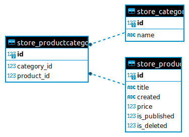

# E-commerce 

E-commerce - backend-сервис на основе `Django REST Framework`, представляющий собой каталог товаров различных категорий. 
В каталоге можно управлять товарами и их категориями. 
Категории можно создавать и удалять(если категория прикреплена к товару возвращается ошибка).
Товары можно создавать, редактировать и удалять. 
При создании товаров, следует указать категории к которым он относится
(если категория существует, товар привязывается к ней, 
в противном случае для связи с товаром автоматически создается новая категория).
При удалении товара, товар остается в базе данных, но помечается как удаленный.
В сервисе реализован поиск товара по его названию, по id категории, по названию категории. 
Также есть возможность фильтровать товары по статусу (опубликован/не опубликован) и диапазону стоимости товара (Цена от и до). 
База данных - `SQLite`. Зависимости - `Poetry`. Линтеры - `Black`, `Flake8`. Контейнеризация - `Docker`

## Описание схемы БД

База данных содержит 3 модели: 
`Product`(Товар), `Category`(Категория товара), 
`ProductCategory`(таблица для связи Продукт-Категория). 
Ниже представлена графическая схема моделей и их взаимосвязей.



## Краткая документация API

Исчерпывающую информацию по работе API можно получить после запуска.
Документация на основе Swagger, в соответствии со стандартом OpenAPI.

## Инструкция по установке

### 1. Подготовка проекта

1.1 Клонируете репозиторий
```sh
git clone https://github.com/XanderMoroz/music_storage_API.git
```
1.2 В корневой папки клонированного репозотория создаете файл .env.dist 

1.3 В файлe .env.dist создаете переменную DJANGO_SECRET_KEY и присваиваете ей случайный код. Например:
```sh
DJANGO_SECRET_KEY=h9wehc98wh393ewcb9h988h2387gf2g8g32fb382gf78027vf38g780237g38738g9f
```

### 2 Запуск проекта с Doker
2.1 Создаете и запускаете контейнер через терминал:
```sh
sudo docker-compose up --build
```
2.2 Сервис доступен по адресу: http://0.0.0.0:8000/